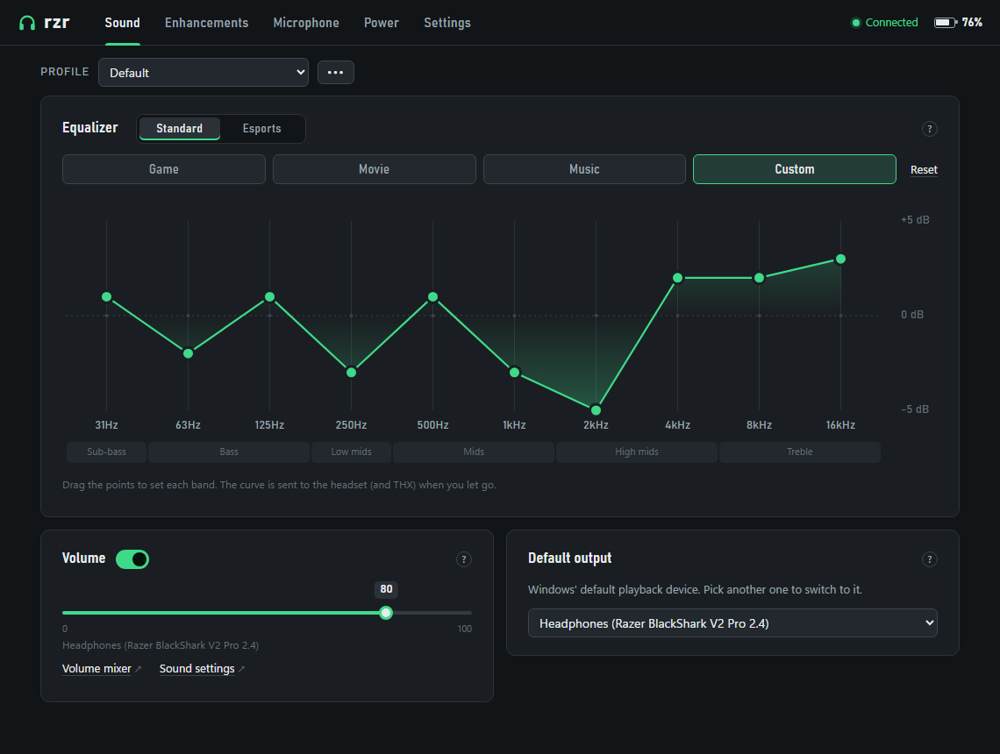
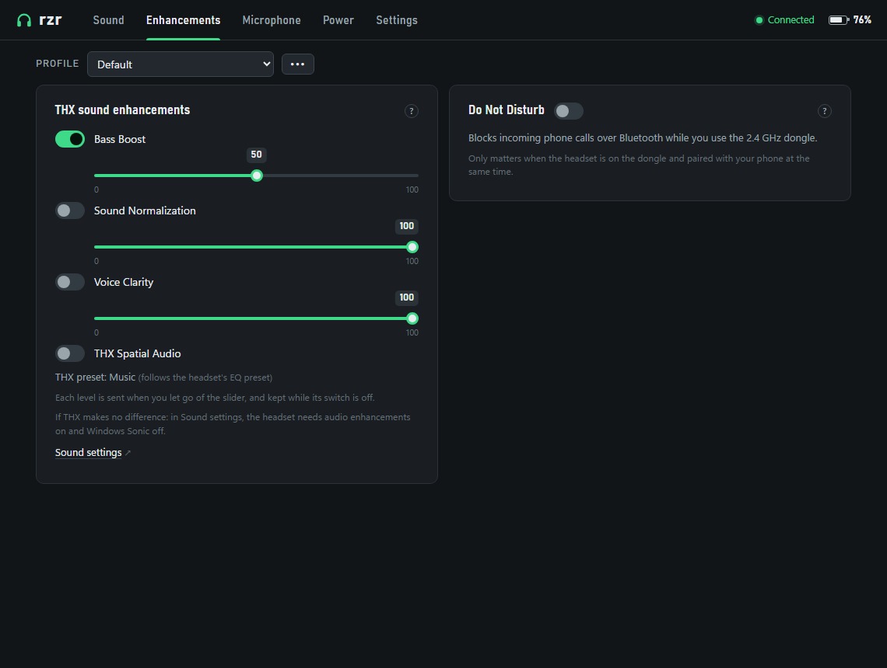
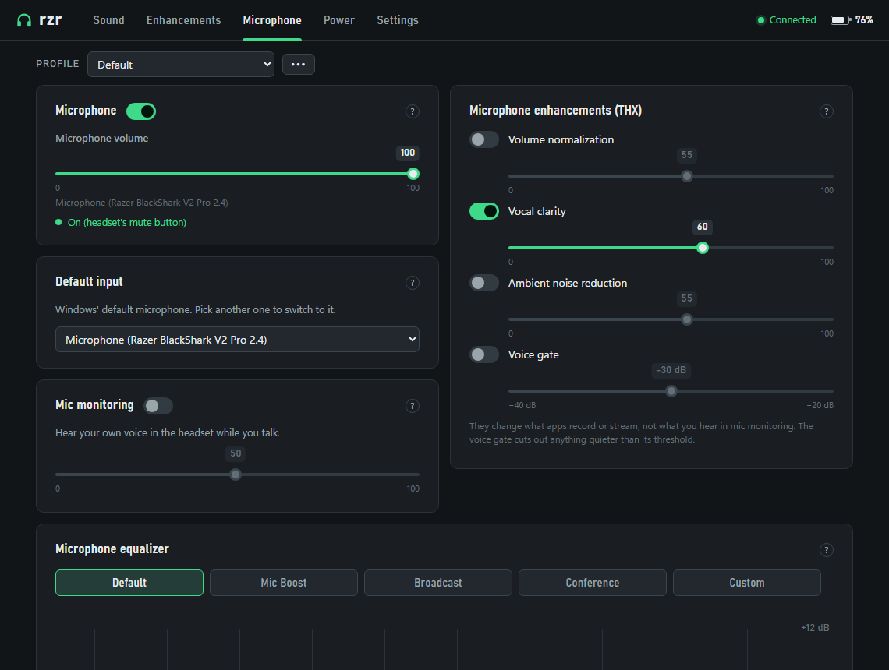
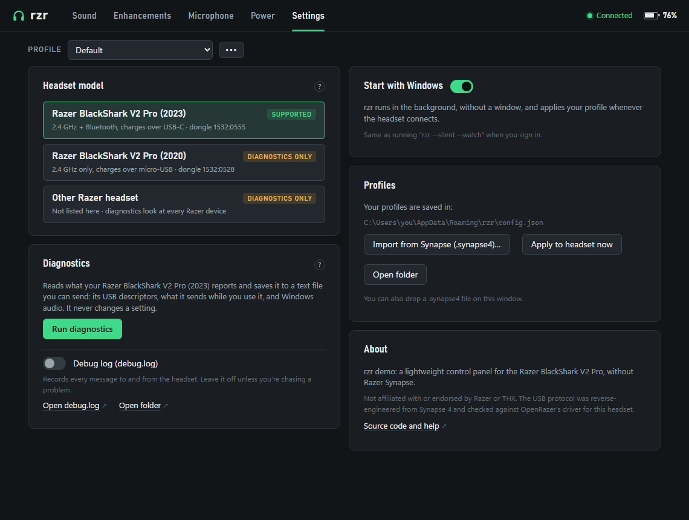

# rzr

**A lightweight control panel for the Razer BlackShark V2 Pro that replaces Razer Synapse.**
One portable 1.6 MB `.exe`: equalizer, THX Spatial Audio, microphone enhancements, mic monitoring, battery and more, with no installer, no account and no background services.

[](https://github.com/Antoniazog493/razer-device-control/actions/workflows/build.yml)
[](https://github.com/Antoniazog493/razer-device-control/releases)
[](LICENSE)




## The problem

Connect a BlackShark V2 Pro without Synapse and it sounds quiet and flat: the headset keeps its factory settings, and the features you bought it for (THX Spatial Audio, Bass Boost, the microphone enhancements) are Windows audio effects that only Synapse knows how to drive. Synapse, meanwhile, is a heavy suite with several background services.

**rzr** sends the headset the same USB commands Synapse sends, talks to THX the way Synapse does, and gives you a small panel to set it all up, in a single small `.exe`.

## Features

| | Feature | Works without Synapse |
|---|---|---|
| 🎚️ | Equalizer: Game, Movie and Music presets, the five esports presets, and a draggable 10-band Custom curve | ✅ |
| 🔊 | THX Spatial Audio, Bass Boost, Sound Normalization and Voice Clarity, with their levels | ✅ (THX must be installed, [see below](#thx-spatial-audio)) |
| 🎙️ | Microphone EQ (Default, Mic Boost, Broadcast, Conference, Custom), normalization, vocal clarity, noise reduction and voice gate | ✅ (through THX) |
| 👂 | Mic monitoring (sidetone) and its level | ✅ |
| 🔋 | Battery, charging, auto power-off, Do Not Disturb, firmware | ✅ |
| 🪟 | Windows volume, mute and default output/input device | ✅ |
| 📁 | Several profiles; import your Synapse profiles (`.synapse4`) | ✅ |
| 🔁 | Start with Windows: applies your profile whenever the headset connects, and follows the headset's EQ button | ✅ |
| 📈 | Connection log of wireless drops, with their duration | ✅ |

<p>
  
  
</p>

## Supported headsets

| Headset | Dongle | Status |
|---|---|---|
| **Razer BlackShark V2 Pro (2023)**, 2.4 GHz + Bluetooth, charges over USB-C | `1532:0555` | ✅ Supported |
| Razer BlackShark V2 Pro (2020), 2.4 GHz only, charges over micro-USB | `1532:0528` | 🔍 Diagnostics only: [help add it](docs/NEW-HEADSETS.md) |
| Other Razer headsets | — | 🔍 Diagnostics only: [help add it](docs/NEW-HEADSETS.md) |

Not sure which one you have? The 2023 model's dongle shows up in Device Manager as `VID_1532&PID_0555`. rzr only ever sends commands to supported models; for the others it has a read-only diagnostics report (Settings › Diagnostics) that you can send to help add them.

## Download and install

1. Download `rzr.exe` from the [latest release](https://github.com/Antoniazog493/razer-device-control/releases/latest) (it's also built on every commit: [Actions](https://github.com/Antoniazog493/razer-device-control/actions) › *Build* › `rzr-windows`).
2. Put it anywhere you like (it's portable) and double-click it.
3. **Close or uninstall Razer Synapse**: both fight over the dongle.

**Requirements:** Windows 10 or 11, and Microsoft Edge WebView2, which both already include. If it's missing, rzr tells you and links the installer; `rzr --watch` and `rzr apply` work without it.

Windows SmartScreen may warn about an unknown publisher, because the `.exe` isn't code-signed. Choose *More info › Run anyway*, or build it yourself (below). The checksum of each release is in its `SHA256SUMS.txt`.

## THX Spatial Audio

THX isn't part of the headset: it's a Windows audio effect that Synapse installs for it. rzr controls it through THX's own service, so **Synapse doesn't need to be open, or even installed**, but THX does.

- **You have Synapse installed:** THX is already there. Open rzr and use the Enhancements tab. You can now uninstall Synapse, but **uninstalling Synapse also removes THX**.
- **You want THX without Synapse:** use the [BlackShark V2 Pro THX restore package](https://github.com/Antoniazog493/blackshark-v2-pro-thx-restore): download, double-click, restart.

If THX makes no difference, open Sound settings: the headset needs **audio enhancements on** and **Windows Sonic off**.

## Using it

Double-click `rzr.exe` and the panel opens. Every change is saved and sent to the headset right away (sliders and the EQ curve when you let go).

- **Profiles:** the `•••` menu next to *Profile* creates, duplicates, renames, deletes and imports profiles.
- **Import from Synapse:** export your profile from Synapse (`.synapse4`) and use *Import from Synapse…*, or **drop the file on the window**. The EQ, mic monitoring, auto power-off and Do Not Disturb are imported.
- **Start with Windows** (Settings): rzr stays in the background, without a window, applies your profile whenever the headset connects, and follows its EQ button.
- **The headset's EQ button:** the panel follows it, and THX switches with it.
- **Connection drops:** each time the headset loses the link and how long it took to come back is written to `%APPDATA%\rzr\connection.log`; the latest show up in *Power*.
- **Something wrong?** Settings › Diagnostics has a debug log (`%APPDATA%\rzr\debug.log`) that records every message to the headset.



### Command line

```
rzr                         Open the panel
rzr apply                   Apply the active profile to the headset
rzr import FILE             Import profiles from a .synapse4 file
rzr --watch                 Watch for the headset and apply the profile on connect
rzr --silent --watch        Same, in the background with no output (what Start with Windows uses)
rzr diagnose [MODEL]        Read-only report for a headset model (--seconds N to listen longer)
rzr help                    Show the help

--debug                     Write debug.log even if it's off in Settings
```

Settings live in `%APPDATA%\rzr\config.json`. The first run migrates the settings of rzr 0.1 from the registry.

## FAQ

**Does it change anything permanently?** The headset stores its own settings (presets, curves, mic monitoring, auto power-off), exactly as Synapse does. THX's settings are stored by THX's own service. rzr never writes the registry directly, except for its own "Start with Windows" entry.

**Can I use it with Synapse installed?** Yes, but not both at once: close Synapse (from the tray icon) before using rzr.

**Why isn't the Custom curve heard?** Without THX installed, some units store the Custom curve but don't play it (see [STATUS.md](docs/STATUS.md#open-questions)). With THX installed, rzr applies the same curve in THX, as Synapse does, and it's heard.

**Is it safe for my headset?** rzr only sends command sequences that Synapse itself sends or that OpenRazer verified on this headset, reads the result back, and never experiments ([ADR 0002](docs/adr/0002-verified-sequences-only.md)).

## How it works

The dongle has a vendor-defined HID interface (USB interface 3, usage page `0xFF00`) that takes 64-byte reports in what Razer calls the "Audio MXIC" protocol. rzr was built by reading Synapse's own logs, which print every command it sends, and checking each one against OpenRazer's driver for this headset. The details are in [docs/PROTOCOL.md](docs/PROTOCOL.md).

THX is driven through its Windows service (`VSSrv`): its COM interface for the switches and the EQ, and the same ZeroMQ messages Synapse sends for the levels and presets ([docs/RESEARCH.md](docs/RESEARCH.md)).

The panel is a plain HTML/CSS/JS page shown in WebView2, controlled from Rust ([docs/ARCHITECTURE.md](docs/ARCHITECTURE.md)).

## Building from source

Install [Rust](https://rustup.rs) (stable, MSVC toolchain on Windows) and run:

```
cargo build --release
```

The executable is `target/release/rzr.exe`. `cargo run -- --demo` opens the panel with a simulated headset, and `ui/index.html` can be opened in any browser with demo data. On Linux (development only) you need `libwebkit2gtk-4.1-dev`.

## Contributing

Bug reports, headset reports and pull requests are welcome. Start with [CONTRIBUTING.md](CONTRIBUTING.md); to help support another headset, see [docs/NEW-HEADSETS.md](docs/NEW-HEADSETS.md). What works and what's next is in [docs/STATUS.md](docs/STATUS.md).

## Credits

- The original protocol work and the first rzr: [Ashesh3/razer-device-control](https://github.com/Ashesh3/razer-device-control).
- Command table and hardware-verified sequences: OpenRazer's driver for this headset ([openrazer/openrazer#2862](https://github.com/openrazer/openrazer/pull/2862)).

## Disclaimer

rzr is an independent project, not affiliated with, endorsed by or supported by Razer Inc. or THX Ltd. Razer, BlackShark and Synapse are trademarks of Razer Inc.; THX and THX Spatial Audio are trademarks of THX Ltd. rzr contains no Razer or THX code or files. Use it at your own risk.

## License

[MIT](LICENSE)
