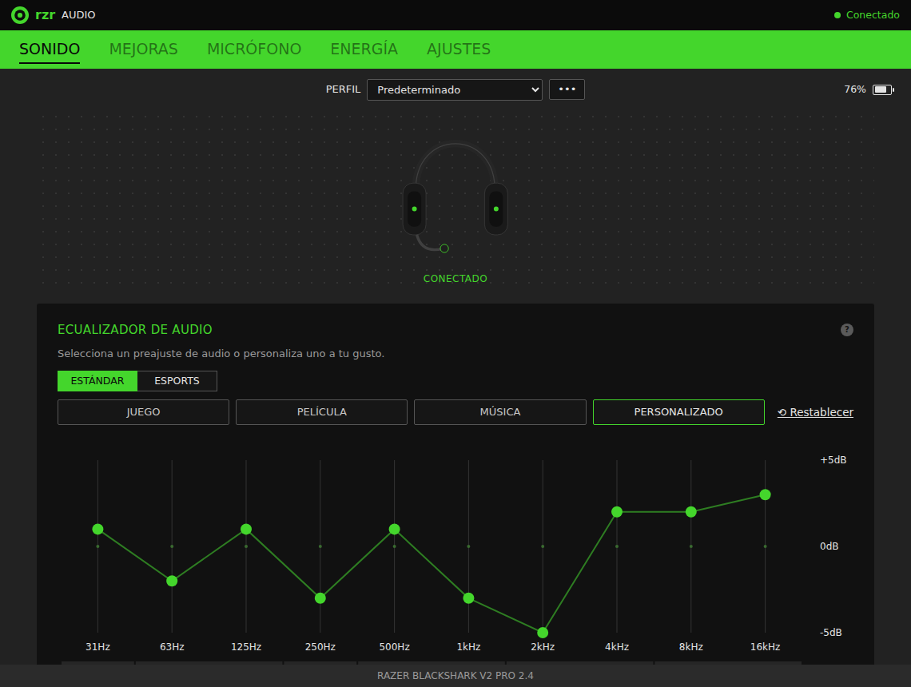
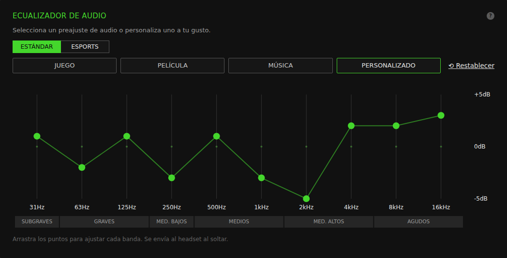
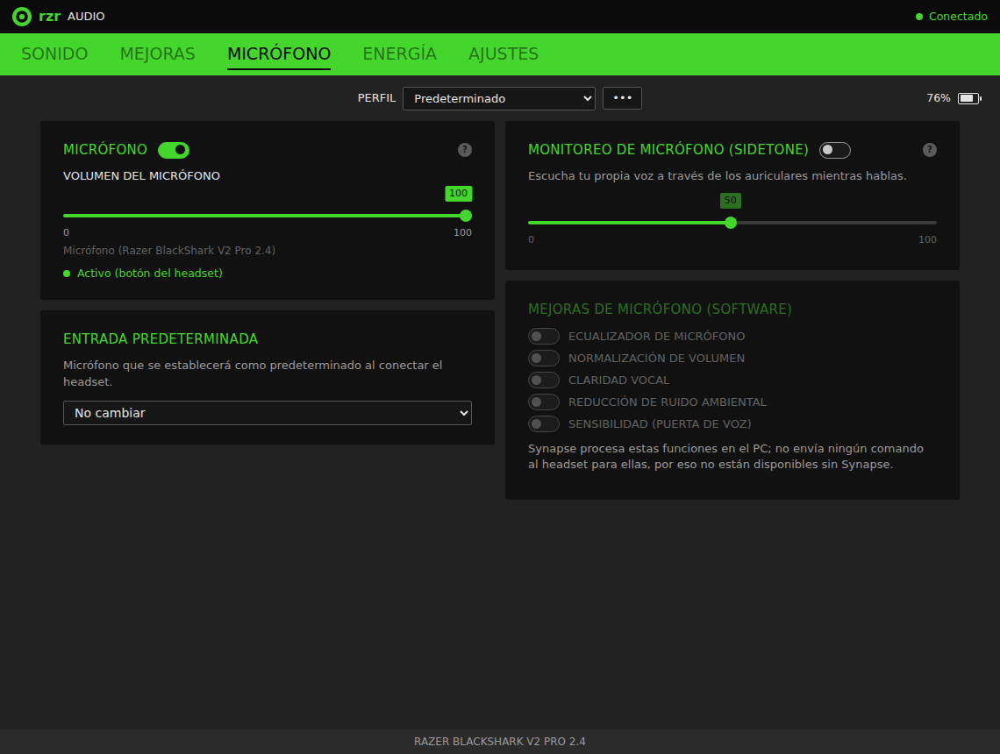

# rzr

Panel de control liviano para los audífonos **Razer BlackShark V2 Pro** (versión 2.4 GHz + Bluetooth, dongle `1532:0555`) que **reemplaza a Razer Synapse**. Es un solo `.exe` portátil de ~1,3 MB, sin instalador ni servicios en segundo plano.







## El problema

Al conectar los BlackShark V2 Pro sin Synapse, el audio suena bajo y plano: los presets integrados del headset son los de fábrica. Synapse envía la configuración real (preset del ecualizador, curva personalizada, etc.) por USB HID cada vez que cambias de perfil. Sin Synapse, esos comandos nunca llegan.

**rzr** envía exactamente los mismos comandos y además te da una interfaz como la de Synapse para configurar todo a tu gusto.

## Qué puedes controlar

| Función | Dónde vive | Estado |
|---|---|---|
| Ecualizador: presets Juego / Película / Música | Headset | ✅ |
| Ecualizador: presets Esports (Apex, CoD, CS2, Fortnite, Valorant) | Headset | ✅ |
| Ecualizador personalizado de 10 bandas (−5 a +5 dB) | Headset | ✅ |
| Monitoreo de micrófono (sidetone) y su nivel | Headset | ✅ |
| Apagado automático (15–60 min) | Headset | ✅ |
| No molestar (bloquear llamadas por Bluetooth) | Headset | ✅ |
| Batería, carga, estado del botón de silencio, firmware, serie | Headset (lectura) | ✅ |
| Volumen de salida y del micrófono, silenciar | Windows | ✅ |
| Dispositivo de salida/entrada predeterminado al conectar | Windows | ✅ |
| Varios perfiles, importar perfiles de Synapse (`.synapse4`) | rzr | ✅ |
| Iniciar con Windows y aplicar el perfil al conectar/reconectar | rzr | ✅ |
| Registro de caídas de conexión (hora y duración de cada corte) | rzr | ✅ |
| Bass Boost, Normalización de sonido, Claridad de voz, THX Spatial Audio | Motor THX en el PC (instalado por Synapse) | ❌ ver abajo |
| EQ de micrófono, normalización, claridad vocal, reducción de ruido, puerta de voz | Software de Synapse en el PC | ❌ ver abajo |

### ¿Por qué faltan algunas funciones de Synapse?

Esas mejoras **no las hace el headset**. Una captura de los logs de Synapse 4 con este headset, activando y desactivando cada opción, lo confirma:

- Synapse **no envía ningún comando USB** al headset para Bass Boost, Normalización, Claridad de voz, THX ni para ninguna mejora del micrófono.
- Bass Boost, Normalización, Claridad de voz y THX Spatial Audio se aplican con `AudioEffectsTHXV3.setRender…`, es decir, en el **motor de audio de THX**. Synapse lo instala en Windows como efecto de audio ("THX Spatial Audio (BlackShark V2 Pro)") y **reemplaza** a los efectos de Windows que traían los audífonos ("Microsoft Audio Home Theater Effects").
- Las mejoras de micrófono no produjeron ni comandos USB ni llamadas a THX.

El efecto de THX queda instalado en Windows como un APO (se carga en `audiodg.exe`), así que el objetivo es que rzr escriba los mismos ajustes que Synapse le da. `tools/capturar-synapse.ps1 -Fase thx` averigua dónde los guarda: foto del registro y de las carpetas de THX/Razer en cada paso, qué paquete de driver lo instala y si sigue sonando con Synapse cerrado.

Sin Synapse, los audífonos vuelven a usar los efectos de Windows, que incluyen **Bass Boost, Loudness Equalization (normalización) y sonido envolvente virtual**. rzr podrá controlarlos una vez identificados sus ajustes: `tools/capturar-synapse.ps1 -Fase windows` los captura. Para el micrófono, las alternativas son [Equalizer APO](https://sourceforge.net/projects/equalizerapo/) (EQ) o NVIDIA Broadcast / RNNoise (reducción de ruido).

## Descarga

- **Compilado automáticamente:** en la pestaña **Actions** del repositorio, abre la última ejecución de *Build* y descarga el artefacto `rzr-windows` (contiene `rzr.exe`).
- **Compilarlo tú:** instala [Rust](https://rustup.rs) (1.95 o superior) y ejecuta `cargo build --release`. El ejecutable queda en `target/release/rzr.exe`.
- **Requisito:** el panel usa Microsoft Edge WebView2, que ya viene con Windows 10 (actualizado) y Windows 11. Si faltara, rzr avisa y enlaza el instalador; `rzr --watch` y `rzr apply` funcionan igual sin él.

## Uso

Haz **doble clic en `rzr.exe`** y se abre el panel. Cada cambio se guarda y se envía al headset al instante. Los cambios de sliders y del ecualizador se envían al soltar.

- **Perfiles:** el menú `•••` junto a *PERFIL* permite crear, duplicar, renombrar, eliminar e importar perfiles.
- **Importar de Synapse:** exporta tu perfil desde Synapse (archivo `.synapse4`) y usa *Importar de Synapse…* o **arrástralo a la ventana**. Se importan el ecualizador, el sidetone, el apagado automático y No molestar.
- **Iniciar con Windows:** actívalo en *AJUSTES*. rzr quedará en segundo plano, sin ventana, y aplicará tu perfil cada vez que el headset se conecte o reconecte.
- **Caídas de conexión:** rzr anota cada vez que el headset pierde el enlace con el dongle y cuánto tardó en volver, en `%APPDATA%\rzr\conexion.log`. Las últimas aparecen en *ENERGÍA*. Usa los avisos que el propio headset envía, así que también detecta cortes de pocos segundos.
- **Botón EQ del headset:** si cambias de preset con el botón físico, el panel lo detecta y actualiza la selección. Si el headset no acepta un cambio hecho desde el panel, el panel muestra el preset que realmente suena y lo avisa.
- **Si el ecualizador no cambia el sonido:** en *AJUSTES › DIAGNÓSTICO* abre la **Prueba guiada del ecualizador**. Con música puesta, prueba cada método (A = graves, B = agudos) y responde si oyes el cambio; rzr se queda con el primero que funcione y guarda todo en `debug.log`.
- **Registro de depuración:** *AJUSTES › DIAGNÓSTICO* (apagado por defecto). Guarda cada comando enviado y recibido del headset en `%APPDATA%\rzr\debug.log` (4 MB como máximo; el anterior queda en `debug.old.log`).

### Línea de comandos

```
rzr                    Abre el panel
rzr apply              Aplica el perfil activo al headset
rzr import ARCHIVO     Importa perfiles de un .synapse4
rzr --watch            Vigila el headset y aplica el perfil al conectar
rzr --silent --watch   Lo mismo, en segundo plano sin salida (para el inicio)
rzr help               Ayuda

--debug                Escribe debug.log aunque esté apagado en AJUSTES
```

La configuración se guarda en `%APPDATA%\rzr\config.json`. La primera vez, rzr migra la configuración de versiones anteriores (`HKCU\SOFTWARE\rzr`).

## Cómo funciona

El dongle expone un endpoint HID propietario (interfaz USB 3, Usage Page `0xFF00`). Se usan reportes de 64 bytes con el protocolo "Audio MXIC" ("PA"):

```
[0]  0x02       report id
[1]  0x80       dirección (host → dispositivo)
[2]  total_len  8 + largo de datos
[5]  0x50 'P'   [6] 0x41 'A'
[7]  inner_len  0x08 (0x0E en el frame de modo remoto)
[9]  cmd_type   0x02 remoto, 0x03 lectura, 0x04 escritura, 0x0D EQ
[10] cmd_id
[11] flag       0 en una petición
[12] data_len
[13] datos...
```

Las respuestas repiten el sub-frame desplazado: `[12]` = id del comando, `[13]` = `0x01` (ACK), `[14]` = largo, `[15..]` = datos.

### Comandos

| Función | Escritura | Lectura | Datos |
|---|---|---|---|
| Modo remoto (antes de cada secuencia) | `02/E1` | — | 1 = software, 0 = headset (en el byte flag) |
| Selector de preset EQ | `04/93` | `03/13` | `07` Juego, `08` Música, `09` Película, `FF` Personalizado; Esports: `FA` Apex, `FB` CS, `FC` Valorant, `FD` Fortnite, `FE` CoD |
| Familia del preset | `04/9D` | — | 1 = clásico, 2 = esports |
| Estado del EQ de presets | `04/9E` | `03/1E` | Synapse envía 0 al iniciar; sin efecto audible según OpenRazer |
| Curva EQ (Personalizado y cada Esports) | `0D/95` | `03/15` | 10 bytes con signo (dB), se guarda en el preset activo |
| Sidetone on/off | `04/98` | `03/18` | 0/1 |
| Nivel de sidetone | `04/99` | `03/19` | Synapse 0–100 → 0–14 (50 → 7) |
| No molestar | `04/A7` | `03/27` | 0/1 |
| Apagado automático | `04/AC` | `03/2C` | minutos (15–60), 0 = nunca |
| Enlace inalámbrico | — | `03/20` | 1 = headset conectado |
| Batería / carga | — | `03/21` / `03/2A` | 0–100 / ≠0 = cargando |
| Botón de silencio | — | `03/55` | 1 = silenciado |
| Firmware / serie | — | `03/02` / `03/00` | |
| Firmware del dongle | — | `06/01` + `C2 03 F8 5F 04` | respuesta con flag `C2`: 4 bytes (p. ej. 2.4.1.0) |

> **Correcciones respecto a la versión anterior:** el comando `0x93` que antes se llamaba "setVolume" es en realidad el **selector de preset** (`255` = `0xFF` = Personalizado, por eso funcionaba). `0x9D` ("setEnhancement") solo indica la familia del preset. El "SET_CONFIG" `06/01` es solo una consulta de la versión del dongle.

Una respuesta puede traer varios mensajes "PI" seguidos. El byte `[1]` es el largo total y cada mensaje mide 13 + largo de datos. El byte flag vale `01` en la respuesta a un comando y `02` en un **evento** que el headset envía por su cuenta: conexión (`20`), batería (`21`), No molestar (`27`), carga (`2A`) y silencio del micrófono (`55`).

### Peculiaridades del firmware

- El enlace 2.4 GHz se duerme tras ~0,3 s sin tráfico y descarta el primer frame que recibe. Cada secuencia empieza con un frame de modo remoto "de sacrificio".
- Un cambio de preset que cruza de familia (clásico ↔ esports) solo cambia la familia. rzr lee el preset activo y reintenta hasta confirmarlo.
- El headset guarda una curva `0x95` en el preset que esté activo. rzr confirma que el preset correcto está activo antes de escribirla. Luego reenvía el selector para que la curva nueva se escuche de inmediato. Igual que Synapse, rzr escribe también la curva de cada preset Esports; Juego/Música/Película vienen de fábrica y solo se seleccionan.
- Los presets Juego/Música/Película editados en Synapse solo cambian el EQ por software de THX; el headset sigue usando su curva de fábrica. Por eso en rzr son de solo lectura.
- Una consulta termina con el modo remoto apagado. Si llega en medio de una escritura de otro proceso, el headset ignora el resto de la escritura. Por eso el panel y el proceso en segundo plano comparten un candado (mutex `Local\rzr_hid_bus`) y nunca envían a la vez.
- Todavía sin confirmar en este headset: si el modo remoto debe quedar encendido para que el EQ se oiga (la primera versión de rzr nunca lo apagaba) y qué hace `0x9E`. La prueba guiada lo averigua y guarda el resultado (`eq_method`, `release_remote`, `eq_status` en `config.json`).

## Código

| Archivo | Contenido |
|---|---|
| `src/protocol.rs` | Construcción de frames, tabla de comandos, presets |
| `src/device.rs` | Comunicación HID y secuencias de escritura (verificada y la original) |
| `src/debuglog.rs` | Registro de depuración opcional (`debug.log`) |
| `src/instance.rs` | Instancia única del proceso en segundo plano y candado del dongle |
| `src/config.rs` | Perfiles y configuración (JSON) |
| `src/synapse.rs` | Importador de `.synapse4` |
| `src/winaudio.rs` | Volumen, silencio y dispositivo predeterminado de Windows |
| `src/worker.rs` | Hilos en segundo plano (headset y audio) para la interfaz |
| `src/gui/` | Ventana (WebView2) y controlador del panel: recibe los comandos de la página y le envía el estado; `diag.rs` es la lógica de la prueba guiada |
| `ui/` | La interfaz: `index.html`, `app.css`, `app.js` (y `demo.js` con datos de prueba) |
| `src/registry.rs` | Migración del registro e inicio con Windows |

`rzr --demo` abre el panel con un headset simulado, útil para probar la interfaz sin el dispositivo.

### Modificar la interfaz

La interfaz es una página web normal en `ui/`, que rzr muestra con WebView2 (el motor de Edge). Rust le envía el estado con `rzr.state(...)` y la página responde con comandos JSON como `{"cmd": "preset", "preset": "custom"}`. El estado lo arma `App::view()` y los comandos son el enum `Msg`, ambos en `src/gui/mod.rs`.

- **Sin compilar:** abre `ui/index.html` en cualquier navegador. Sin rzr detrás, carga `demo.js` con datos de prueba y puedes probar casi todo.
- **Con rzr:** `set RZR_UI_DIR=C:\ruta\a\ui` y luego `rzr --demo`. rzr lee la página de esa carpeta en vez de la incluida en el `.exe`: edita y pulsa F5.
- **Agregar una función:** en el HTML, los atributos `data-text`, `data-show`, `data-toggle` y `data-slider` enlazan elementos con el estado (ver el comentario al inicio de `index.html`). Luego se agrega el comando a `Msg` y el dato a `App::view()`.

Para compilar en Linux (solo para desarrollo) hace falta `libwebkit2gtk-4.1-dev`.

## Créditos

- Protocolo original por ingeniería inversa de Synapse 4: [Ashesh3/razer-device-control](https://github.com/Ashesh3/razer-device-control).
- Tabla de comandos y secuencias verificadas en hardware: driver de OpenRazer para este headset ([openrazer/openrazer#2862](https://github.com/openrazer/openrazer/pull/2862)).

## Licencia

MIT
